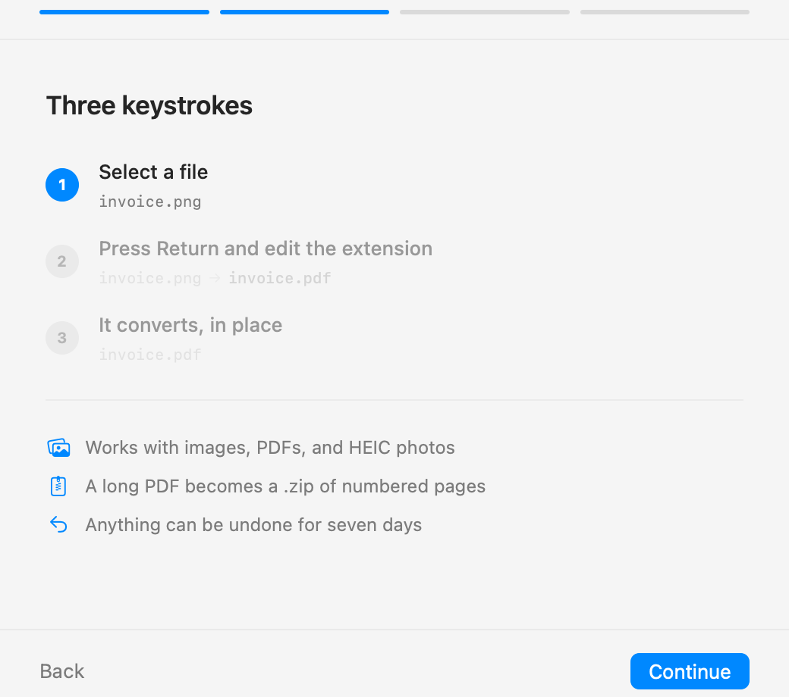
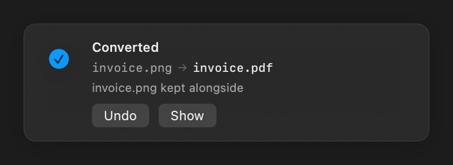

<div align="center">


# Suffix

**Convert files by renaming them.**

Select a file in Finder. Press Return. Change `.png` to `.pdf`.
The file becomes a real PDF.

[**⬇ Download for macOS**](https://github.com/PewPewBiches/Suffix/releases/latest) · [How it works](#how-to-use-it) · [What it converts](#what-it-converts)

macOS 14 or later · Free · Open source · No account, no upload, no network

</div>

---

## The thing this removes

You have a photo and you need a PDF. So you search "png to pdf", pick one of the
identical sites, upload your file to a stranger's server, wait, close a popup,
download the result, find it in Downloads, move it back where it belongs, and
delete the original.

That is nine steps and a stranger's server, to change a file format your Mac has
been able to change on its own the entire time.

Suffix makes it one step: **rename the file.**

```
invoice.png  →  invoice.pdf
```

Nothing is uploaded. Nothing leaves your Mac. There is no window to open, no
file picker, no "drag your file here". You already know how to rename a file.

---

## How to use it



1. **Click a file** in Finder
2. **Press Return** and edit the part after the dot
3. **Press Return again**

A second later a notice confirms it, with **Undo** if you didn't mean it.



That's the whole app. It lives in your menu bar and does nothing else.

### Some things worth trying

| Rename this | To this | And you get |
|---|---|---|
| `screenshot.png` | `screenshot.txt` | **The text in the image**, read out of it |
| `scan.pdf` | `scan.txt` | The words from a scanned document |
| `photo.heic` | `photo.jpg` | An iPhone photo anything can open |
| `report.docx` | `report.pdf` | A PDF you can send |
| `deck.pages` | `deck.pdf` | Exactly what Pages would export |
| `clip.mov` | `clip.mp4` | The same video, in the container everything accepts |
| `talk.mp4` | `talk.m4a` | Just the audio |
| `brochure.pdf` | `brochure.jpg` | Every page as an image, in a `.zip` |

---

## Install

Download `Suffix.dmg` from [Releases](../../releases), drag Suffix to your
Applications folder, and open it.

### The first time you open it

Suffix isn't signed with a paid Apple Developer certificate, so macOS will
refuse to open it and say it "cannot be verified". This is Gatekeeper reacting
to the app being unsigned, not to anything the app does.

1. Try to open Suffix. Let macOS block it.
2. Go to **System Settings → Privacy & Security**.
3. Scroll down. There's a line about Suffix being blocked — click **Open Anyway**.

You only do this once. If you'd rather not trust a stranger's build, the whole
app is here — clone it and run `./Scripts/build-app.sh` to build your own.

### Give it access to your files

Setup walks through this. There are three permissions, each shown with what it
is for and — the part usually left out — what it does not allow:

| macOS asks | Because | What it does not allow |
|---|---|---|
| **Full Disk Access** *(required)* | Desktop, Documents, Downloads and iCloud Drive are protected. Without it Suffix runs perfectly and converts nothing in the four folders you use. | Reads a file only when you rename it to a different format, and only that file. There is no networking in the app at all. |
| **Control Finder** *(for the shortcut)* | The keyboard shortcut arrives with no files attached, so it asks Finder what you selected. | One question per press. It cannot move, open or delete anything through this. |
| **Control Pages / Keynote / Numbers** *(for those formats)* | A `.pages` file is a sealed bundle only Apple's app can open, so Suffix asks it to export. | Opens, exports, closes. It does not edit or save over your original. |

Only the first needs a trip to System Settings; macOS prompts for the other two
itself, at the moment they are first needed. **Settings → Permissions** shows
the same list afterwards, measured live rather than remembered — so when
something stops working you can see which permission went away.

The last setup step converts a real file to prove the whole chain works. Don't
skip it. A silent, healthy-looking failure is this app's characteristic way of
going wrong.

---

## Two ways to use it

### Rename a file

Change its extension in Finder. That's the whole gesture, and it covers every
conversion in the tables below.

### Select several files, press ⌥⌘S

Some things a filename can't say. "Merge these three" has no name to type it
into, and "compress this" needs a quality setting. Those live in one panel,
opened either by the shortcut or by right-clicking and choosing
**Suffix: file actions**.

| Action | What it does |
|---|---|
| **Merge into one PDF** | PDFs and images, combined in the order you selected them |
| **Compress** | Smallest / Balanced / Best, plus a quality slider and a measured size estimate |
| **Create ZIP archive** | A plain archive — nothing re-encoded |

The panel greys out what doesn't apply and says why, rather than the entry
quietly not being there. The shortcut is changeable in Settings → Finder.

---

## What it converts

### Images and PDFs

|  | PNG | JPEG | TIFF | GIF | BMP | HEIC | PDF | TXT |
|---|:-:|:-:|:-:|:-:|:-:|:-:|:-:|:-:|
| **PNG · JPEG · TIFF · GIF · BMP · HEIC** | ● | ● | ● | ● | ● | ● | ● | ● |
| **WebP** | ● | ● | ● | ● | ● | ● | ● | ● |
| **PDF** | ● | ● | ● | ● | ● | ● | – | ● |

Any image can become text — Suffix reads the words in it using the Vision
framework built into macOS. A PDF becomes text the same way, falling back to
reading the pages when the document is a scan with no text layer.

A PDF of more than one page becomes a **`.zip` of numbered images**, because one
image cannot hold a hundred pages. Suffix asks first, and names the result
`document.zip` rather than the `document.jpg` you typed.

### Video and audio

|  | MOV | MP4 | M4V | M4A | WAV | AIFF | MP3 |
|---|:-:|:-:|:-:|:-:|:-:|:-:|:-:|
| **MOV · MP4 · M4V** | ● | ● | ● | ● | ● | ● | ○ |
| **M4A · WAV · AIFF · MP3** | – | – | – | ● | ● | ● | ○ |

Video to video normally copies the existing streams instead of re-encoding, so
it is fast and loses nothing. Video to audio extracts the soundtrack.

**○ MP3 needs a helper.** macOS ships an MP3 *decoder* but no encoder, so Suffix
uses `ffmpeg` or `lame` if one is installed:

```bash
brew install ffmpeg
```

Suffix looks for an encoder rather than bundling one — nothing to ship, nothing
to license. If you'd rather not, `.m4a` is the native equivalent and needs
nothing.

### Documents

| From | To PDF |
|---|---|
| **Pages · Keynote · Numbers** | ● exact — needs that Apple app installed |
| **Word · RTF · OpenDocument · HTML · plain text** | ● approximate |

**Read this before converting a document you plan to send.** Only iWork files
convert exactly, because Suffix asks Pages (or Keynote, or Numbers) to export
them. Everything else is re-laid-out by macOS's own text engine: text and basic
formatting survive, but tables, columns, headers and footers, and exact
pagination do not. Suffix says so on the notice — check the result.

### What it never touches

Archives, code, spreadsheets, other apps' libraries, and anything whose contents
aren't a format above. A `.zip` renamed to `.png` is left exactly as it is, and
your Photos library is never opened.

---

## Is this safe?

**Your files never leave your Mac.** Suffix has no network code in it at all.
Conversion uses only what ships with macOS — ImageIO, PDFKit, AVFoundation,
Vision.

**Nothing is destroyed.** Before anything is overwritten, the original is copied
to `~/Library/Application Support/Suffix/Originals` and kept for seven days.
Every conversion can be undone from the menu bar, and stored originals are
deleted automatically after a week.

**You choose whether the original stays.** Set during setup, changeable any time:

| | After renaming `photo.png` to `photo.pdf` |
|---|---|
| **Replace the file** | `photo.pdf` — one file, as renaming implies |
| **Keep both** | `photo.pdf` and `photo.png`, side by side |

**It only acts on a deliberate rename.** Not on files you copy, download, or
move — only when you change a file's extension yourself, to something Suffix can
actually produce, and the contents don't already match.

---

## How it works

Renaming a file in Finder only changes its name; the bytes are untouched. Suffix
watches for rename events, checks whether the file's real format still matches
its new extension, and re-encodes it when it doesn't.

Everything is decided from the file's **contents**, never its name. A text file
called `notes.jpg` is left alone. A PNG called `photo.jpg` is converted.

---

## Development

```bash
swift test                                     # engine tests
./Scripts/build-app.sh                         # assemble Suffix.app
./Scripts/make-dmg.sh 0.3.1                    # build a release disk image
build/Suffix.app/Contents/MacOS/Suffix --render-previews /tmp/ui
```

That last one renders the app's screens to PNG in both themes. Note its limit:
`ImageRenderer` cannot rasterise AppKit-backed controls, so anything built from
`Form`, `Picker` or `Toggle` comes out blank or as placeholder glyphs.

`suffixctl` drives the same engine from the command line:

```bash
.build/debug/suffixctl inspect photo.jpg    # what is it really?
.build/debug/suffixctl plan photo.jpg       # what would converting do?
.build/debug/suffixctl convert photo.jpg    # do it
.build/debug/suffixctl watch ~/Desktop      # react to renames in a folder
```

`SUFFIX_DEBUG=1` prints raw filesystem events. The app logs to
`~/Library/Logs/Suffix.log`.

| Path | What's in it |
|---|---|
| `Sources/ConvertKit` | Format detection, planning, conversion, watching. No UI. |
| `Sources/SuffixApp` | The menu-bar app. |
| `Sources/suffixctl` | Command-line front end. |

### Notes for anyone touching the watcher

Four behaviours cost real debugging time here, and every one of them presents
identically: a watcher that looks healthy and does nothing.

- **`kFSEventStreamCreateFlagUseCFTypes` is mandatory.** Without it the callback
  receives a C `char**`, and reading it as a `CFArray` is silently wrong.
- **`FSEventStreamSetExclusionPaths` returns `true` and then suppresses every
  event** on a file-level stream. Directory filtering is done in Swift instead.
- **A rename can arrive as `Removed | Renamed` coalesced into one event.**
  Filtering out `Removed` drops real renames; existence on disk is the reliable
  test of which name survived.
- **Reading a file can block on a permission decision.** Doing that on the main
  thread freezes the whole app with no visible cause.

Test watcher changes in a busy folder through Finder, not with `mv` in an empty
directory — a quiet folder never reproduces the coalescing.

One more, for media: **AVFoundation infers a file's type from its extension**,
unlike ImageIO which reads the bytes. Since this app exists precisely because
the extension is wrong, media files are staged under their true name first.

---

## Licence

MIT. See [LICENSE](LICENSE).
